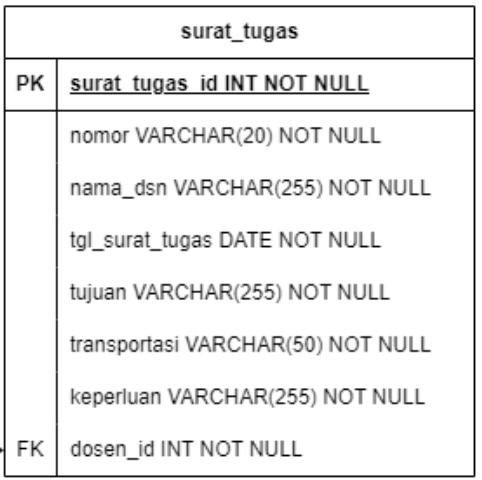
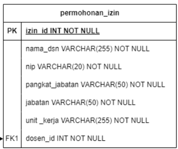

# <p align="center"> PWEB 2 - Tugas 2 </p>

<p><b> Case Study </b><br> 
surat_tugas & permohonan izin</p>

<p><b> Task </b><br>
1. Create an OOP-based View, by retrieving data from the MySQL database<br>
2. Use the _construct as a link to the database<br>
3. Apply encapsulation according to the logic of the case study<br>
4. Create a derived class using the concept of inheritance<br>
5. Apply polymorphism for at least 2 roles according to the case study<br></p>

<p><b> Tables </b><br>
1. surat_tugas<br><br>
2. permohonan_izin<br>
</p>

### Langkah 1
<p> Membuat koneksi untuk menghubungkan ke database</p>

```php
<?php
class connection {
    private $host = "localhost";
    private $username = "root";
    private $password = "";
    private $dbname = "tugas2";
    protected $db;

    public function __construct()
    {
        $this->db = new mysqli($this->host, $this->username, $this->password, $this->dbname);
        return $this->db;
    }
    
    public function getDosen(){
        return;
    }
}

$database = new connection();
?>
```

<b align="center">Penjelasan :</b><br>
Pada Langkah pertama untuk mendapatkan sebuah data dari database kita perlu menghubungkannya terlebih dahulu. Pada program diatas terdapat sebuah class dengan nama `connection`. Di dalam class tersebut terdapat beberapa properti yang bersifat private maupun protected. Pada properti `$host` ini berfungsi untuk menyimpan nama server database yang di sebutkan yaitu localhost. Di class tersebut juga terdapat properti `$username` dimana properti tersebut menyimpan nama pengguna bernama `$root` yang digunakan untuk mengakses sebuah database. Terdapat juga properti `$password` dimana password tersebut tidak memiliki isi/value yang berarti tidak memerlukan password untuk mengakses database. Terdapat juga properti `$dbname` yang berisi tugas2, ini berarti menandakan bahwa data yang disimpan ada di database yang bernama tugas2, selanjutnya terdapat properti `$db` yang bersifat protected, `$db` ini berfungsi untuk menyimpan objek koneksi database.

`__Construct` pada class connection tersebut berfungsi untuk menginstansiasi objek `mysqli` dengan parameter host, username, password, dan dbname yang dimana hasil instansiasi tersebut akan disimpan ke dalam `$db`

Selanjutnya membuat method `getDosen()` method ini digunakan untuk mengambil data yang ada di database.

### Langkah 2
<p>Metode inheritance dan polymorphism dari class connection</p>

```php
<?php
// Menghubungkan file koneksi ke dalam index
include 'koneksi.php'; 

// Class surat tugas yang merupakan anakan dari connection
class surat_tugas extends connection{
    // method untuk mengambil data dari tabel surat_tugas pada database
    public function getDosen(){
        $tugas = parent::__construct()->query("SELECT * FROM surat_tugas");
        return $tugas;
    }
}

// Class permohonan izin yang merupakan anakan dari connection
class permohonan_izin extends connection {
    // method untuk mengambil data dari tabel permohonan_izin pada database
    public function getDosen(){
        $izin = parent::__construct()->query("SELECT * FROM permohonan_izin");
        return $izin;
    }
}
// instansiasi objek
$tugas = new surat_tugas();
$izin = new permohonan_izin();
// variable permohonan yang berisi method permohonan yang berisi permohonan_izin
$permohonan=$izin->getDosen('permohonan_izin');
// variable surat yang berisi method permohonan untuk tabel surat_tugas
$surat=$tugas->getDosen('surat_tugas');
?>
```
<b>Penjelasan</b><br>
Pada langkah ini terdapat sebuah class baru yang bernama `surat_tugas` dimana surat tugas itu extend dari class `connection`, Fungsi class `surat_tugas` ini sendiri yaitu mengambil data yang ada pada tabel `surat_tugas` di database. fungsi ini menggunakaan method dari `getDosen` yang berada pada class `connection`.

Selain class `surat_tugas` terdapat juga class `permohonan_izin` yang merupakan extend dari class `connection`, class ini berfungsi juga untuk mengambil data yang ada pada tabel `permohonan_izin` di database. class ini mempunyai method yang sama yaitu memanggil `getDosen()` untuk mengambil data.

### Langkah 3
<p> Membuat tabel dan mencetak isi data ke dalam tabel</p>

```html
<!-- Tampilan tabel surat tugas untuk role administrator -->
    <div class="container" id="adminTugas" style="margin-top: 20px; display: none;">
        <h1 class="text-center">Surat Tugas (Administrator)</h1>
        <table class="table mt-5" style="text-align: center ;">
            <!-- Table Head Surat Tugas Administrator -->
            <thead>
                <tr>
                    <th class="">Nomor</th>
                    <th class="">Nama Dosen</th>
                    <th class="">Tanggal Surat</th>
                    <th class="">Tujuan</th>
                    <th class="">Transportasi</th>
                    <th class="">Keperluan</th>
                </tr>
            </thead>
            <!-- Proses mencetak isi data pada database ke dalam tabel untuk admin -->
            <tbody>
                <?php
                foreach($surat as $row) { ?>
                <tr>
                    <td><?php echo $row['nomor']; ?></td>
                    <td><?php echo $row['nama_dsn']; ?></td>
                    <td><?php echo $row['tgl_surat_tugas']; ?></td>
                    <td><?php echo $row['tujuan']; ?></td>
                    <td><?php echo $row['transportasi']; ?></td>
                    <td><?php echo $row['keperluan']; ?></td>
                    </tr>
                <?php } ?>
            </tbody>
        </table>
        <a class="kembali btn btn-primary" href="index.php" role="button">Kembali</a>
    </div>
    <!-- Tampilan tabel surat tugas untuk role Dosen -->
    <div class="container" id="dosenTugas" style="margin-top: 20px; display: none;">
        <h1 class="text-center">Surat Tugas (Dosen)</h1>
        <table class="table mt-5" style="text-align: center ;">
            <!-- Table head untuk surat tugas role dosen -->
            <thead>
                <tr>
                    <th class="">Nama Dosen</th>
                    <th class="">Tanggal Surat</th>
                    <th class="">Tujuan</th>
                </tr>
            </thead>
            <!-- Proses mencetak isi data pada database ke dalam tabel untuk dosen -->
            <tbody>
                <?php
                foreach($surat as $row) {
                ?>
                <tr>
                    <td><?php echo $row['nama_dsn']; ?></td>
                    <td><?php echo $row['tgl_surat_tugas']; ?></td>
                    <td><?php echo $row['tujuan']; ?></td>
                    </tr>
                <?php }?>
            </tbody>
        </table>
    </div>
```
<b>Penjelasan : </b><br>

Tabel tersebut terbagi menjadi 2 role, satu role untuk Administrator dan satu role lagi untuk Dosen. Potongan program ini terletak pada bagian bawah dari metode Inheritance dan Polymorphism yang sebelumnya dijelaskan. Untuk menampilkan isi dari tabelnya dapat digunakan foreach lalu dilanjutkan menyebutkan `namaobjek` sebagai `$row`.