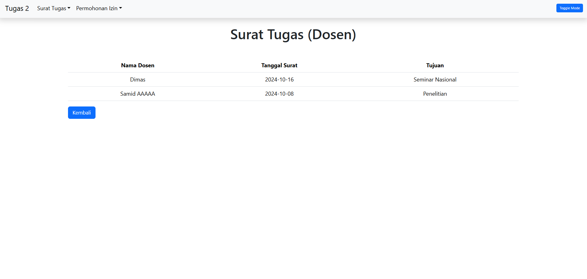

<pre>
Nama  : Kristian Dimas Adi Wicaksono
Kelas : TI-2C
NPM   : 230302065</pre>
# <p align="center"> PWEB 2 - Tugas 2 </p>

<p><b> Case Study </b><br> 
surat_tugas & permohonan izin</p>

<p><b> Task </b><br>
1. Create an OOP-based View, by retrieving data from the MySQL database<br>
2. Use the _construct as a link to the database<br>
3. Apply encapsulation according to the logic of the case study<br>
4. Create a derived class using the concept of inheritance<br>
5. Apply polymorphism for at least 2 roles according to the case study<br></p>

<p><b> Tables </b><br>
1. surat_tugas<br><br>
2. permohonan_izin<br>
</p>
<div align= justify>

### Langkah 1
<p> Membuat koneksi untuk menghubungkan ke database</p>

```php
<?php
class connection {
    private $host = "localhost";
    private $username = "root";
    private $password = "";
    private $dbname = "tugas2";
    protected $db;

    public function __construct()
    {
        $this->db = new mysqli($this->host, $this->username, $this->password, $this->dbname);
        return $this->db;
    }
    
    public function getDosen(){
        return;
    }
}

$database = new connection();
?>
```

<b align="center">Penjelasan :</b><br>
Pada Langkah pertama untuk mendapatkan sebuah data dari database kita perlu menghubungkannya terlebih dahulu. Pada program diatas terdapat sebuah class dengan nama `connection`. Di dalam class tersebut terdapat beberapa properti yang bersifat private maupun protected. Pada properti `$host` ini berfungsi untuk menyimpan nama server database yang di sebutkan yaitu localhost. Di class tersebut juga terdapat properti `$username` dimana properti tersebut menyimpan nama pengguna bernama `$root` yang digunakan untuk mengakses sebuah database. Terdapat juga properti `$password` dimana password tersebut tidak memiliki isi/value yang berarti tidak memerlukan password untuk mengakses database. Terdapat juga properti `$dbname` yang berisi tugas2, ini berarti menandakan bahwa data yang disimpan ada di database yang bernama tugas2, selanjutnya terdapat properti `$db` yang bersifat protected, `$db` ini berfungsi untuk menyimpan objek koneksi database.

`__Construct` pada class connection tersebut berfungsi untuk menginstansiasi objek `mysqli` dengan parameter host, username, password, dan dbname yang dimana hasil instansiasi tersebut akan disimpan ke dalam `$db`

Selanjutnya membuat method `getDosen()` method ini digunakan untuk mengambil data yang ada di database.

### Langkah 2
<p>Metode inheritance dan polymorphism dari class connection</p>

```php
<?php
// Menghubungkan file koneksi ke dalam index
include 'koneksi.php'; 

// Class surat tugas yang merupakan anakan dari connection
class surat_tugas extends connection{
    // method untuk mengambil data dari tabel surat_tugas pada database
    public function getDosen(){
        $tugas = parent::__construct()->query("SELECT * FROM surat_tugas");
        return $tugas;
    }
}

// Class permohonan izin yang merupakan anakan dari connection
class permohonan_izin extends connection {
    // method untuk mengambil data dari tabel permohonan_izin pada database
    public function getDosen(){
        $izin = parent::__construct()->query("SELECT * FROM permohonan_izin");
        return $izin;
    }
}
// instansiasi objek
$tugas = new surat_tugas();
$izin = new permohonan_izin();
// variable permohonan yang berisi method permohonan yang berisi permohonan_izin
$permohonan=$izin->getDosen('permohonan_izin');
// variable surat yang berisi method permohonan untuk tabel surat_tugas
$surat=$tugas->getDosen('surat_tugas');
?>
```
<b align="center">Penjelasan :</b><br>
Pada langkah ini terdapat sebuah class baru yang bernama `surat_tugas` dimana surat tugas itu extend dari class `connection`, Fungsi class `surat_tugas` ini sendiri yaitu mengambil data yang ada pada tabel `surat_tugas` di database. fungsi ini menggunakaan method dari `getDosen` yang berada pada class `connection`.


Selain class `surat_tugas` terdapat juga class `permohonan_izin` yang merupakan extend dari class `connection`, class ini berfungsi juga untuk mengambil data yang ada pada tabel `permohonan_izin` di database. class ini mempunyai method yang sama yaitu memanggil `getDosen()` untuk mengambil data.

### Langkah 3
<p> Membuat tabel dan mencetak isi data ke dalam tabel</p>

<h4>1. Tabel Surat Tugas</h4>

```html
<!-- Tampilan tabel surat tugas untuk role administrator -->
    <div class="container" id="adminTugas" style="margin-top: 20px; display: none;">
        <h1 class="text-center">Surat Tugas (Administrator)</h1>
        <table class="table mt-5" style="text-align: center ;">
            <!-- Table Head Surat Tugas Administrator -->
            <thead>
                <tr>
                    <th class="">Nomor</th>
                    <th class="">Nama Dosen</th>
                    <th class="">Tanggal Surat</th>
                    <th class="">Tujuan</th>
                    <th class="">Transportasi</th>
                    <th class="">Keperluan</th>
                </tr>
            </thead>
            <!-- Proses mencetak isi data pada database ke dalam tabel untuk admin -->
            <tbody>
                <?php
                foreach($surat as $row) { ?>
                <tr>
                    <td><?php echo $row['nomor']; ?></td>
                    <td><?php echo $row['nama_dsn']; ?></td>
                    <td><?php echo $row['tgl_surat_tugas']; ?></td>
                    <td><?php echo $row['tujuan']; ?></td>
                    <td><?php echo $row['transportasi']; ?></td>
                    <td><?php echo $row['keperluan']; ?></td>
                    </tr>
                <?php } ?>
            </tbody>
        </table>
        <a class="kembali btn btn-primary" href="index.php" role="button">Kembali</a>
    </div>
    <!-- Tampilan tabel surat tugas untuk role Dosen -->
    <div class="container" id="dosenTugas" style="margin-top: 20px; display: none;">
        <h1 class="text-center">Surat Tugas (Dosen)</h1>
        <table class="table mt-5" style="text-align: center ;">
            <!-- Table head untuk surat tugas role dosen -->
            <thead>
                <tr>
                    <th class="">Nama Dosen</th>
                    <th class="">Tanggal Surat</th>
                    <th class="">Tujuan</th>
                </tr>
            </thead>
            <!-- Proses mencetak isi data pada database ke dalam tabel untuk dosen -->
            <tbody>
                <?php
                foreach($surat as $row) {
                ?>
                <tr>
                    <td><?php echo $row['nama_dsn']; ?></td>
                    <td><?php echo $row['tgl_surat_tugas']; ?></td>
                    <td><?php echo $row['tujuan']; ?></td>
                    </tr>
                <?php }?>
            </tbody>
        </table>
    </div>
```
<b align="center">Penjelasan :</b><br>
Tabel tersebut terbagi menjadi 2 role, satu role untuk Administrator
dan satu role lagi untuk Dosen. Potongan program ini terletak pada bagian bawah dari metode 
Inheritance dan Polymorphism yang sebelumnya dijelaskan. Untuk menampilkan isi dari tabelnya dapat digunakan 
`foreach` lalu dilanjutkan menyebutkan objek `$surat` sebagai `$row`.

Berdasarkan program di atas, semua data berasal dari objek `$surat` yang diambil sesuai dengan kebutuhan tabel seperti `Nomor`, `Nama Dosen`, `Tanggal Surat Tugas`,
`Tujuan`, `Transportasi`, dan `Keperluan`. Pada tabel yang dapat dilihat oleh administrator lebih rinci
dibandingkan untuk role dosen. Dimana role dosen hanya berisi `Nama Dosen`, `Tanggal Surat Tugas`, dan `Tujuan`.

<h4>2. Tabel Permohonan Izin</h4>

Selain itu terdapat juga tabel data yang berisi permohonan izin dengan kode program sebagai berikut.

```html
<!-- Tampilan tabel permohonan izin untuk role administrator -->
    <div class="container" id="adminIzin" style="margin-top: 20px; display: none;">
        <h1 class="text-center">Permohonan Izin (Administrator)</h1>
        <table class="table mt-5" style="text-align: center ;">
            <thead>
                <tr>
                    <th>Nama Dosen</th>
                    <th>NIP</th>
                    <th>Pangkat Jabatan</th>
                    <th>Jabatan</th>
                    <th>Unit Kerja</th>
                </tr>
            </thead>
            <!-- Proses mencetak isi data pada databaseke dalam tabel untuk administrator -->
            <tbody>
                <?php
                foreach($permohonan as $row) { ?>
                <tr>
                    <td><?php echo $row['nama_dsn']; ?></td>
                    <td><?php echo $row['nip']; ?></td>
                    <td><?php echo $row['pangkat_jabatan']; ?></td>
                    <td><?php echo $row['jabatan']; ?></td>
                    <td><?php echo $row['unit_kerja']; ?></td>
                    </tr>
                <?php } ?>
            </tbody>
        </table>
    </div>
    <!-- Tampilan tabel permohonan izin untuk role dosen -->
    <div class="container" id="dosenIzin" style="margin-top: 20px; display: none;">
        <h1 class="text-center">Permohonan Izin(Dosen)</h1>
        <table class="table mt-5" style="text-align: center ;">
            <thead>
                <tr>
                    <th class="">Nama Dosen</th>
                    <th class="">NIP</th>
                    <th class="">Jabatan</th>
                </tr>
            </thead>
            <!-- Proses mencetak isi data pada database ke dalam tabel untuk dosen -->
            <tbody>
                <?php
                foreach($permohonan as $row) {
                ?>
                <tr>
                    <td><?php echo $row['nama_dsn']; ?></td>
                    <td><?php echo $row['nip']; ?></td>
                    <td><?php echo $row['jabatan']; ?></td>
                    </tr>
                <?php }?>
            </tbody>
        </table>
    </div>
```
<b align="center">Penjelasan :</b><br>
Tabel ini dibagi juga menjadi 2 role yaitu role untuk akses Administrator dan akses Dosen. Program ini juga terletak pada bagian bawah inheritance dan Polymorphism. Untuk menampilkan isinya digunakan perintah foreach yang berfungsi untuk mengambil data yang sebelumnya sudah diproses melalui method pada class Inheritance dari connection yang dimana data tersebut disimpan dalam `$permohonan` yang kemudian akan dicetak sebagai `$row`.

setiap data yang ada pada `$permohonan` ini akan diambil sesuai dengan kebutuhan tabel seperti `Nama Dosen`, `NIP`, `Pangkat Jabatan`, `Jabatan`, dan `Unit Kerja`. Pada role Administrator tabel yang diberikan cukup rinci jika dibandingkan dengan tabel untuk role dosen yang hanya berisi `Nama Dosen`, `NIP`, dan `Jabatan`.

### Langkah 4

Membuat tampilan untuk menampilkan tabel data

```html
<!DOCTYPE html>
<html lang="en">
<head>
    <meta charset="UTF-8">
    <meta name="viewport" content="width=device-width, initial-scale=1.0">
    <link href="https://cdn.jsdelivr.net/npm/bootstrap@5.3.3/dist/css/bootstrap.min.css" rel="stylesheet" integrity="sha384-QWTKZyjpPEjISv5WaRU9OFeRpok6YctnYmDr5pNlyT2bRjXh0JMhjY6hW+ALEwIH" crossorigin="anonymous">
    <script src="https://cdn.jsdelivr.net/npm/bootstrap@5.3.3/dist/js/bootstrap.bundle.min.js" integrity="sha384-YvpcrYf0tY3lHB60NNkmXc5s9fDVZLESaAA55NDzOxhy9GkcIdslK1eN7N6jIeHz" crossorigin="anonymous"></script>
    <title>Tugas 2</title>
</head>
<style>
    .container .btn{
        position: relative;
        font-size: 15px;
        justify-content: center;
    }
    .btn{
        font-size: 10px;
    }
    .navbar-light {
        background-color: #f8f9fa;
        color: #000;
    }
    .navbar-light .navbar{
        background-color: #000;
        color: #fff;
    }
    .navbar-light .navbar-brand,
    .navbar-light .nav-link {
        color: #000;
    }
    .dark-mode {
        background-color: #343a40;
        color: #fff;
    }
    .dark-mode .navbar-brand, .dark-mode .nav-link {
        color: #000;
    }
    .navbar-nav .nav-link.active, .navbar-nav .nav-link.show {
        color: #000;
    }
    .nav-item .dropdown-menu{
        margin-top: 10px;
    }
</style>
<body>
    <!-- Membuat sebuah navbar -->
    <nav class="navbar navbar-expand navbar-light shadow rounded" style="padding-left: 20px;">
        <a class="navbar-brand" href="index.php">Tugas 2</a>
        <button class="navbar-toggler" type="button" data-bs-toggle="collapse" data-bs-target="#navbarNavDropdown" aria-controls="navbarNavDropdown" aria-expanded="false" aria-label="Toggle navigation">
            <span class="navbar-toggler-icon">
        </button>
        <div class="collapse navbar-collapse" id="navbarNavDropdown">
            <!-- Dropdown untuk pilihan Surat Tugas -->
            <ul class="navbar-nav">
                <li class="nav-item dropdown">
                    <a class="nav-link dropdown-toggle" href="#" id="navbarDropdownMenuLink" data-bs-toggle="dropdown">Surat Tugas</a>
                    <div class="dropdown-menu" aria-labelledby="navbarDropdownMenuLink">
                        <a class="dropdown-item" href="#" onclick="showContent('adminTugas')">Surat Tugas (Administrator)</a>
                        <a class="dropdown-item" href="#" onclick="showContent('dosenTugas')">Surat Tugas (Dosen)</a>
                    </div>
                </li>
            </ul>
            <!-- Dropdown untuk pilihan Permohonan izin -->
            <ul class="navbar-nav">
                <li class="nav-item dropdown">
                    <a class="nav-link dropdown-toggle" href="#" id="navbarDropdownMenuLink" data-bs-toggle="dropdown">Permohonan Izin</a>
                    <div class="dropdown-menu" aria-labelledby="navbarDropdownMenuLink">
                    <a class="dropdown-item" href="#" onclick="showContent('adminIzin')">Permohonan izin (Administrator)</a>
                    <a class="dropdown-item" href="#" onclick="showContent('dosenIzin')">Permohonan izin (Dosen)</a>
                    </div>
                </li>
            </ul>
            <button class="btn btn-primary position-absolute end-0 bottom-0 m-3 btn-sm" id="toggle-mode">Toggle Mode</button>
        </div>
    </nav>
    <div class="Body">
        <!-- Kalimat pada tampilan awal halaman -->
        <div class="position-absolute top-50 start-50 translate-middle text-center" id="welcomeMessage">
            <h2>Selamat Datang!</h2>
            <p>Harap menekan salah satu tombol diatas untuk menampilkan data.</p>
        </div>
    </div>
</body>
<!-- Fungsi js untuk menghilangkan tampilan jika tidak ditekan tombolnya -->
    <script>
        function showContent(type){
            document.getElementById('welcomeMessage').style.display = 'none';
            document.getElementById('adminTugas').style.display = 'none';
            document.getElementById('dosenTugas').style.display = 'none';
            document.getElementById('adminIzin').style.display = 'none';
            document.getElementById('dosenIzin').style.display = 'none';


            document.getElementById(type).style.display = 'block';
        }
        const toggleButton = document.getElementById('toggle-mode');
            const bodyElement = document.body;

            toggleButton.addEventListener('click', () => {
                const currentTheme = bodyElement.getAttribute('data-bs-theme');
                if (currentTheme === 'dark') {
                    bodyElement.setAttribute('data-bs-theme', 'light');
                } else {
                    bodyElement.setAttribute('data-bs-theme', 'dark');
                }
            });
    </script>
</html>
```
<b align="center">Penjelasan :</b><br>
Program diatas menunjukkan bahwa class navbar berfungsi untuk membuat `navbar` yang dimana perintah tersebut dipanggil berdasarkan perintah yang tersedia pada bootstrap.

Pada bagian bawah `Body` terdapat tag `<script>` yang berisi untuk menghide sebuah tabel apabila pilihannya tidak dipilih, contohnya dropdown surat tugas yang berisi Surat Tugas (Administrator) dan Surat Tugas (Dosen).Isi tabel ini tidak akan muncul apabila pengguna tidak memilih salah satu dari dropdown ini. selain itu ada juga fungsi untuk toggle theme (Mengubah Tema) untuk button toggle mode.

### Hasil

<h4>Program keseluruhan</h4>
Koneksi

```php
<?php
class connection {
    private $host = "localhost";
    private $username = "root";
    private $password = "";
    private $dbname = "tugas2";
    protected $db;

    public function __construct()
    {
        $this->db = new mysqli($this->host, $this->username, $this->password, $this->dbname);
        return $this->db;
    }
    
    public function getDosen(){
        return;
    }
}

$database = new connection();
?>
```

Index
```html
<?php
// Menghubungkan file koneksi ke dalam index
include 'koneksi.php'; 

// Class surat tugas yang merupakan anakan dari connection
class surat_tugas extends connection{
    // method untuk mengambil data dari tabel surat_tugas pada database
    public function getDosen(){
        $tugas = parent::__construct()->query("SELECT * FROM surat_tugas");
        return $tugas;
    }
}

// Class permohonan izin yang merupakan anakan dari connection
class permohonan_izin extends connection {
    // method untuk mengambil data dari tabel permohonan_izin pada database
    public function getDosen(){
        $izin = parent::__construct()->query("SELECT * FROM permohonan_izin");
        return $izin;
    }
}
// instansiasi objek
$tugas = new surat_tugas();
$izin = new permohonan_izin();
// variable permohonan yang berisi method permohonan yang berisi permohonan_izin
$permohonan=$izin->getDosen('permohonan_izin');
// variable surat yang berisi method permohonan untuk tabel surat_tugas
$surat=$tugas->getDosen('surat_tugas');
?>
<!DOCTYPE html>
<html lang="en">
<head>
    <meta charset="UTF-8">
    <meta name="viewport" content="width=device-width, initial-scale=1.0">
    <link href="https://cdn.jsdelivr.net/npm/bootstrap@5.3.3/dist/css/bootstrap.min.css" rel="stylesheet" integrity="sha384-QWTKZyjpPEjISv5WaRU9OFeRpok6YctnYmDr5pNlyT2bRjXh0JMhjY6hW+ALEwIH" crossorigin="anonymous">
    <script src="https://cdn.jsdelivr.net/npm/bootstrap@5.3.3/dist/js/bootstrap.bundle.min.js" integrity="sha384-YvpcrYf0tY3lHB60NNkmXc5s9fDVZLESaAA55NDzOxhy9GkcIdslK1eN7N6jIeHz" crossorigin="anonymous"></script>
    <title>Tugas 2</title>
</head>
<style>
    .container .btn{
        position: relative;
        font-size: 15px;
        justify-content: center;
    }
    .btn{
        font-size: 10px;
    }
    .navbar-light {
        background-color: #f8f9fa;
        color: #000;
    }
    .navbar-light .navbar{
        background-color: #000;
        color: #fff;
    }
    .navbar-light .navbar-brand,
    .navbar-light .nav-link {
        color: #000;
    }
    .dark-mode {
        background-color: #343a40;
        color: #fff;
    }
    .dark-mode .navbar-brand, .dark-mode .nav-link {
        color: #000;
    }
    .navbar-nav .nav-link.active, .navbar-nav .nav-link.show {
        color: #000;
    }
    .nav-item .dropdown-menu{
        margin-top: 10px;
    }
</style>
<body>
    <!-- Membuat sebuah navbar -->
    <nav class="navbar navbar-expand navbar-light shadow rounded" style="padding-left: 20px;">
        <a class="navbar-brand" href="index.php">Tugas 2</a>
        <button class="navbar-toggler" type="button" data-bs-toggle="collapse" data-bs-target="#navbarNavDropdown" aria-controls="navbarNavDropdown" aria-expanded="false" aria-label="Toggle navigation">
            <span class="navbar-toggler-icon">
        </button>
        <div class="collapse navbar-collapse" id="navbarNavDropdown">
            <!-- Dropdown untuk pilihan Surat Tugas -->
            <ul class="navbar-nav">
                <li class="nav-item dropdown">
                    <a class="nav-link dropdown-toggle" href="#" id="navbarDropdownMenuLink" data-bs-toggle="dropdown">Surat Tugas</a>
                    <div class="dropdown-menu" aria-labelledby="navbarDropdownMenuLink">
                        <a class="dropdown-item" href="#" onclick="showContent('adminTugas')">Surat Tugas (Administrator)</a>
                        <a class="dropdown-item" href="#" onclick="showContent('dosenTugas')">Surat Tugas (Dosen)</a>
                    </div>
                </li>
            </ul>
            <!-- Dropdown untuk pilihan Permohonan izin -->
            <ul class="navbar-nav">
                <li class="nav-item dropdown">
                    <a class="nav-link dropdown-toggle" href="#" id="navbarDropdownMenuLink" data-bs-toggle="dropdown">Permohonan Izin</a>
                    <div class="dropdown-menu" aria-labelledby="navbarDropdownMenuLink">
                    <a class="dropdown-item" href="#" onclick="showContent('adminIzin')">Permohonan izin (Administrator)</a>
                    <a class="dropdown-item" href="#" onclick="showContent('dosenIzin')">Permohonan izin (Dosen)</a>
                    </div>
                </li>
            </ul>
            <button class="btn btn-primary position-absolute end-0 bottom-0 m-3 btn-sm" id="toggle-mode">Toggle Mode</button>
        </div>
    </nav>
    <div class="Body">
        <!-- Kalimat pada tampilan awal halaman -->
        <div class="position-absolute top-50 start-50 translate-middle text-center" id="welcomeMessage">
            <h2>Selamat Datang!</h2>
            <p>Harap menekan salah satu tombol diatas untuk menampilkan data.</p>
        </div>
    </div>
    <!-- Tampilan tabel surat tugas untuk role administrator -->
    <div class="container" id="adminTugas" style="margin-top: 20px; display: none;">
        <h1 class="text-center">Surat Tugas (Administrator)</h1>
        <table class="table mt-5" style="text-align: center ;">
            <!-- Table Head Surat Tugas Administrator -->
            <thead>
                <tr>
                    <th class="">Nomor</th>
                    <th class="">Nama Dosen</th>
                    <th class="">Tanggal Surat</th>
                    <th class="">Tujuan</th>
                    <th class="">Transportasi</th>
                    <th class="">Keperluan</th>
                </tr>
            </thead>
            <!-- Proses mencetak isi data pada database ke dalam tabel untuk admin -->
            <tbody>
                <?php
                foreach($surat as $row) { ?>
                <tr>
                    <td><?php echo $row['nomor']; ?></td>
                    <td><?php echo $row['nama_dsn']; ?></td>
                    <td><?php echo $row['tgl_surat_tugas']; ?></td>
                    <td><?php echo $row['tujuan']; ?></td>
                    <td><?php echo $row['transportasi']; ?></td>
                    <td><?php echo $row['keperluan']; ?></td>
                    </tr>
                <?php } ?>
            </tbody>
        </table>
        <a class="kembali btn btn-primary" href="index.php" role="button">Kembali</a>
    </div>
    <!-- Tampilan tabel surat tugas untuk role Dosen -->
    <div class="container" id="dosenTugas" style="margin-top: 20px; display: none;">
        <h1 class="text-center">Surat Tugas (Dosen)</h1>
        <table class="table mt-5" style="text-align: center ;">
            <!-- Table head untuk surat tugas role dosen -->
            <thead>
                <tr>
                    <th class="">Nama Dosen</th>
                    <th class="">Tanggal Surat</th>
                    <th class="">Tujuan</th>
                </tr>
            </thead>
            <!-- Proses mencetak isi data pada database ke dalam tabel untuk dosen -->
            <tbody>
                <?php
                foreach($surat as $row) {
                ?>
                <tr>
                    <td><?php echo $row['nama_dsn']; ?></td>
                    <td><?php echo $row['tgl_surat_tugas']; ?></td>
                    <td><?php echo $row['tujuan']; ?></td>
                    </tr>
                <?php }?>
            </tbody>
        </table>
        <a class="kembali btn btn-primary" href="index.php" role="button">Kembali</a>
    </div>
    <!-- Tampilan tabel permohonan izin untuk role administrator -->
    <div class="container" id="adminIzin" style="margin-top: 20px; display: none;">
        <h1 class="text-center">Permohonan Izin (Administrator)</h1>
        <table class="table mt-5" style="text-align: center ;">
            <thead>
                <tr>
                    <th>Nama Dosen</th>
                    <th>NIP</th>
                    <th>Pangkat Jabatan</th>
                    <th>Jabatan</th>
                    <th>Unit Kerja</th>
                </tr>
            </thead>
            <!-- Proses mencetak isi data pada databaseke dalam tabel untuk administrator -->
            <tbody>
                <?php
                foreach($permohonan as $row) { ?>
                <tr>
                    <td><?php echo $row['nama_dsn']; ?></td>
                    <td><?php echo $row['nip']; ?></td>
                    <td><?php echo $row['pangkat_jabatan']; ?></td>
                    <td><?php echo $row['jabatan']; ?></td>
                    <td><?php echo $row['unit_kerja']; ?></td>
                    </tr>
                <?php } ?>
            </tbody>
        </table>
        <a class="kembali btn btn-primary" href="index.php" role="button">Kembali</a>
    </div>
    <!-- Tampilan tabel permohonan izin untuk role dosen -->
    <div class="container" id="dosenIzin" style="margin-top: 20px; display: none;">
        <h1 class="text-center">Permohonan Izin(Dosen)</h1>
        <table class="table mt-5" style="text-align: center ;">
            <thead>
                <tr>
                    <th class="">Nama Dosen</th>
                    <th class="">NIP</th>
                    <th class="">Jabatan</th>
                </tr>
            </thead>
            <!-- Proses mencetak isi data pada database ke dalam tabel untuk dosen -->
            <tbody>
                <?php
                foreach($permohonan as $row) {
                ?>
                <tr>
                    <td><?php echo $row['nama_dsn']; ?></td>
                    <td><?php echo $row['nip']; ?></td>
                    <td><?php echo $row['jabatan']; ?></td>
                    </tr>
                <?php }?>
            </tbody>
        </table>
        <a class="kembali btn btn-primary" href="index.php" role="button">Kembali</a>
    </div>
</body>
<!-- Fungsi js untuk menghilangkan tampilan jika tidak ditekan tombolnya -->
    <script>
        function showContent(type){
            document.getElementById('welcomeMessage').style.display = 'none';
            document.getElementById('adminTugas').style.display = 'none';
            document.getElementById('dosenTugas').style.display = 'none';
            document.getElementById('adminIzin').style.display = 'none';
            document.getElementById('dosenIzin').style.display = 'none';


            document.getElementById(type).style.display = 'block';
        }
        const toggleButton = document.getElementById('toggle-mode');
            const bodyElement = document.body;

            toggleButton.addEventListener('click', () => {
                const currentTheme = bodyElement.getAttribute('data-bs-theme');
                if (currentTheme === 'dark') {
                    bodyElement.setAttribute('data-bs-theme', 'light');
                } else {
                    bodyElement.setAttribute('data-bs-theme', 'dark');
                }
            });
    </script>
</html>
```

#### Dokumentasi :

- index (Landing Page) Light Mode

<br>

- index (Landing Page) Dark Mode


- Surat Tugas (Administrator)

<br>

- Surat Tugas (Dosen)

<br>

- Permohonan Izin (Administrator)


- Permohonan Izin (Dosen)


</div>